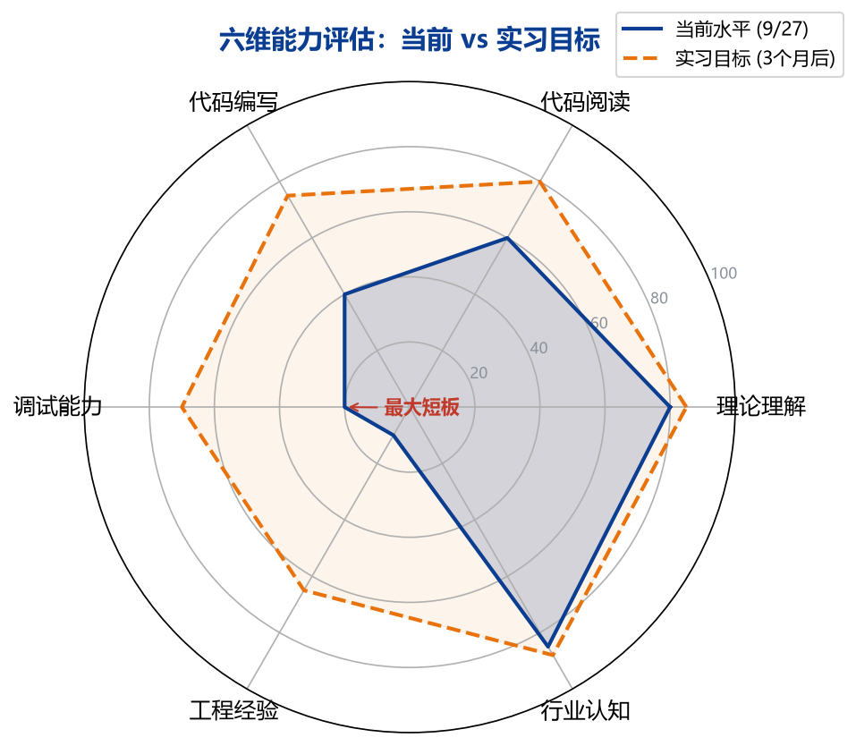
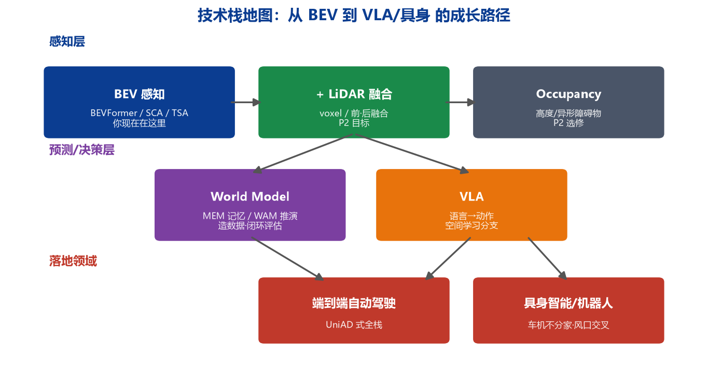
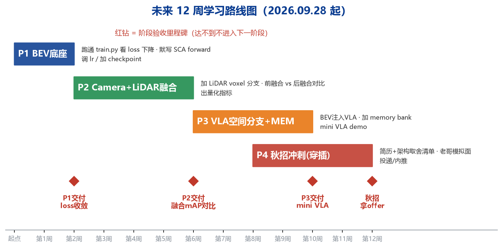

# BEV 智能驾驶方向 · 个人学习报告与阶段指导

报告日期：2026 年 9 月 27 日
学习周期：2026.08.22 — 2026.09.27（约 5 周）
学习主题：BEVFormer 源码精读 + 智驾技术栈认知 + 实习/秋招准备
工程载体：bev 项目（BEVFormer 学习版，6.64M 参数，已跑通推理 demo）

---

## 一、这五周你到底学了什么（学习历程回顾）

你的学习不是"看课式"的，而是围绕一个真实工程，按"先建立全局 → 再死磕核心 → 最后动手跑通"的路径推进的。按时间复盘：

| 时间 | 阶段 | 关键动作 | 产出 |
|------|------|---------|------|
| 8/22 | 工程搭建 | 从零搭出 BEVFormer 学习版完整工程 | 8 个模型文件 + 数据/训练/可视化全链路 |
| 8 月下旬 | 建立全局 | 理清每个文件夹职责、数据流主线 | 能口述"图像→Backbone→Query→Encoder→Head" |
| 9 月上旬 | 行业视野 | 研究 VLA+LiDAR 融合冲突、BEV/WM/VLA 演进 | 建立技术演进认知，判断风口方向 |
| 9 月中旬 | 死磕 SCA | 连续追问归一化、网格、投影、offset、双线性采样 | 07 号笔记：SCA 五步信息变换图解 |
| 9 月下旬 | 动手验证 | 跑通 infer.py（4 帧 10 张图）、逐行读全部 demo 代码 | 真实看到投影红点、读懂训练循环 |
| 9/27 | 深入组件 | 逐行吃透残差块设计原理 | 08 号笔记：BasicBlock 逐行解析 |

==你最有价值的学习习惯是"不接受类比，追问到机制层"==——从"归一化是不是为了省算力"一直追到"双线性采样为什么可微"，这种连续追问是真正学懂算法的标志，多数研究生只停在第一层类比。

---

## 二、当前已掌握的知识清单（确认你会的）

以下内容你已经能够独立复述和解释，属于"已拿到手"的知识：

1. BEV Query 的本质：把连续物理空间离散成 50×50 网格，每个 Query 有明确的空间管辖区域
2. 归一化坐标 [0,1] 与物理坐标（米）的关系，以及为什么相机投影前必须反归一化
3. SCA 五步完整链路：生成参考点 → 投影 6 相机 → 学 offset/weights → 双线性采样 → 加权汇总
4. 几何先验 + 可学习注意力的结合：投影解决"去哪看"，offset 解决"精确看哪"，weights 解决"信几分"
5. 双线性采样的两个不可替代作用：亚像素连续插值 + 让采样可微（梯度能传回 offset）
6. TSA 的核心：用 ego_pose 把历史帧 warp 对齐到当前坐标系再融合（你能用 Live Photo 类比讲清差异）
7. 残差块设计：F(x)+x、downsample 形状对齐、BN 作用、梯度 +1 高速路原理
8. Dataset 契约：__getitem__ 返回固定格式，合成数据换真实数据时模型代码不用改
9. 行业认知：BEV（感知）→ World Model（预测）→ VLA（决策）的分工与融合趋势
10. 工程全局：demo 启动链、infer.py 每帧执行流程、10 张可视化图各自含义

---

## 三、当前能力的诚实评估

### 3.1 六维评分（100 分制）

| 能力维度 | 分数 | 依据 |
|---------|------|------|
| 理论理解 | 80 | 能讲清架构与核心机制，追问能跟上；数学推导层尚浅 |
| 代码阅读 | 60 | 能读懂训练循环、数据集、残差块；mmdet3d 原版未碰 |
| 代码编写 | 40 | 能改参数，但未独立写过新模块 |
| 调试能力 | 20 | demo 的两个 shape bug 由 AI 修复，独立定位经验几乎为零 |
| 工程经验 | 10 | 未独立跑过完整训练、未调过超参、未碰真实数据集 |
| 行业认知 | 85 | 风口判断、人脉资源、技术演进理解是明显长板 |

综合判断：==你处于"理论入门偏上、工程入门偏下"的阶段，最大短板是动手调试与工程经验==。这不是能力问题，是投入结构问题——过去 5 周你 80% 时间在"读和问"，只有 20% 在"写和错"。

### 3.2 三个必须正视的差距

1. shape mismatch 无法独立定位。demo 中"252≠256 整除问题""head reshape 维度问题"都是最基础的张量错误，实习中这类问题每天都会遇到
2. 没见过 loss 曲线。没有亲手把 loss 从震荡调到收敛，就不理解 BN、学习率、梯度在干什么
3. 环境基本功薄弱。pip 不在 PATH 这类问题应在 30 秒内自行解决，不能成为拦路虎

---

## 四、你在行业中的真实位置与机会

### 4.1 你的坐标

技术栈分三层：感知层（BEV/融合/Occupancy）、预测决策层（World Model/VLA）、落地领域（智驾/具身）。
==你现在站在感知层入口，而这个位置恰好是通向所有上层的唯一地基==——做 World Model 需要状态表示，做 VLA 需要空间注入，做 LiDAR 融合更绕不开 BEV。地基不白打。

### 4.2 两个稀缺资源（多数同龄人没有）

- 技术判断力：你已经知道 VLA 的无记忆/推理差/执行差三大痛点，知道 MEM、WAM、空间学习分支是解法方向。这在实习生面试中属于"超出简历"的谈资
- 25 岁架构师人脉：同龄、本科、直接负责 LiDAR+VLA 融合、被前高管看好。这不是"前辈资源"，而是==未来 1-2 年可能带你进扩张团队的"同行通道"==，窗口有保质期，必须在秋招前用起来

---

## 五、未来 12 周学习路线（9.28 起）

路线的核心原则：==每个阶段有硬性交付物，达不到不进入下一阶段==，防止"又看懂了但没做出来"的循环重演。

### Phase 1（第 1-2 周）：BEV 底座夯实 —— 目标是"手能跟上脑"

必须完成：

1. 独立跑通 training/train.py，亲眼看到 loss 下降并保存曲线截图
2. 做学习率对比实验：1e-4 vs 5e-4 vs 1e-3，记录 loss 行为差异（正常/震荡/发散）
3. 不看现有代码，在白纸上默写 SCA 的 forward（投影→offset→grid_sample→加权），形状全对
4. 给训练脚本加 checkpoint 定期保存和 best-loss 选取逻辑

验收标准（红钻里程碑）：loss 稳定收敛；SCA 默写形状全对；能说出 loss 不降时优先查的 5 个地方（学习率、数据归一化、标签、梯度是否为零、mask 是否生效）。

### Phase 2（第 3-6 周）：Camera + LiDAR 融合 —— 这是你区别于 99% 候选人的标签

必须完成：

1. 新增 models/lidar_backbone.py：点云体素化 + 3D 稀疏卷积（spconv）出 BEV 特征
2. 实现两种融合并对比：前融合（特征级 concat+SE 权重）与后融合（结果级）
3. 在合成数据上做消融，给出量化对比表（哪怕只是合成指标，重点是实验方法论）
4. 产出《LiDAR+BEV 融合架构取舍清单》，这是给老哥看、也是面试杀招

需要理解透的概念：体素化与稀疏性、点云到 BEV 的投影、SE/通道注意力加权、前融合与后融合的工程权衡。

### Phase 3（第 7-10 周）：VLA 空间分支 + MEM —— 踩中风口

必须完成：

1. 把融合后的 BEV 特征经投影层注入一个小型 VLA 的 action expert
2. 实现一个最简 memory bank：历史 BEV 摘要的写入、检索、淘汰
3. 做出 mini VLA demo：输入简单语言指令 + 多帧感知 → 输出轨迹 token
4. 能讲清 MEM 解决"无记忆"、WAM 解决"无预测"、空间分支解决"只知道看不知道做"

需要理解透的概念：动作离散化/tokenization、快慢系统（VLM 慢思考 + BEV 快策略）、记忆的写入与检索策略、世界模型的状态转移 P(s'|s,a)。

### Phase 4（第 8-12 周穿插）：秋招冲刺

简历定型 → 老哥做一次模拟面试 → 根据反馈补漏 → 正式投递与内推。

---

## 六、接下来必须"理解"而非"知道"的概念清单

"知道"是听过名词，"理解"是能在白纸上推导、能回答边界情况。以下按优先级排列：

### 第一优先（2 周内，全部要能手写）

- 透视投影完整公式：P_cam = R·X + t，u = fx·Xc/Zc + cx，v = fy·Yc/Zc + cy，并解释 Zc≤0 为何丢弃
- softmax 注意力的矩阵形式：Attention(Q,K,V) = softmax(QKᵀ/√d)V，能对着 SCA 指出 Q/K/V 分别是谁
- 双线性插值的 4 邻居权重计算，以及为什么它对采样坐标可导
- 残差连接的反传公式：∂(F(x)+x)/∂x = ∂F/∂x + 1
- PyTorch 训练四件套：forward、loss、backward、optimizer.step 各自改变了什么

### 第二优先（6 周内，结合融合项目理解）

- 外参/内参/位姿三个 4×4/3×3 矩阵的数学含义与坐标系方向约定
- warp 的相对变换：T_rel = inv(pose_prev) · pose_curr 的推导
- 体素化、稀疏卷积为什么比稠密 3D 卷积省算力
- Focal Loss 为什么能解决正负样本极度不平衡

### 第三优先（10 周内，达到面试可聊深度）

- 世界模型三大用途（造数据/闭环评估/想象式规划）各自的输入输出
- VLA 动作 token 化方案、diffusion policy 与自回归 policy 的区别
- Occupancy 为什么能补 BEV 压扁高度的缺陷

---

## 七、每周节奏建议（可持续，不拼时长）

- 工作日每天 2 小时：40 分钟读源码/论文，60 分钟写代码改代码，20 分钟写学习日志
- 周末半天：做一个完整实验并记录结果（改了什么、现象是什么、为什么）
- ==每周必须产出一个"可展示物"==：一张 loss 图、一段新模块代码、一份对比表、一篇笔记。没有产出的一周等于没学
- 每两周向老哥同步一次进展，只发"做出来的东西 + 一个具体问题"，不发"在学了"

### 与老哥的互动纪律

- 本周：主动汇报 demo 已跑通 + 你在训练上的第一个实验结果，问一个架构问题（如：LiDAR 与 BEV 你们做前融合还是后融合？）
- 两周一次节奏：带着 demo/清单/对比数据交流，定位是"未来同行"不是"求带小白"
- 内推话术核心：==面试我自己搞定，绝不给你丢人==——年轻架构师推荐人最怕砸招牌，你主动消除这个顾虑

---

## 八、风险提示（避开三个坑）

1. 只追热点不打地基。VLA、世界模型很诱人，但没有扎实的 BEV/几何/工程功底，上层全部是空中楼阁，面试官两个问题就问穿
2. 用"看懂了"自我感动。读十遍不如写错一遍，接下来 12 周请把时间结构倒过来：60% 动手，40% 阅读
3. 人脉只维护不输出。同龄牛人不会长期当免费顾问，你要持续给他学术圈/论文/开源的新信息，关系是对等交换

---

## 九、结语

五周时间，你从"不知道 BEV 是什么"走到"能逐行讲清 SCA 五步和残差块、能判断 VLA 行业趋势、跑通了完整工程"，这个速度不慢。

但也要清醒：==从"能讲"到"能做"之间，隔着的不是智商，是几百个小时的动手和报错==。你那位 25 岁的架构师朋友，三年前也修过无数个 shape bug。你和他的差距不在天赋，在动手时长——这个差距从明天开始，每天都能缩小一点。

下一步动作只有一个：打开 training/train.py，跑第一次训练，让它报错，然后自己查。卡住超过 20 分钟再求助。

---

附：本报告配套文件

- 07_SCA五步_信息变换图解.md / .pdf
- 08_残差块BasicBlock_逐行解析.md / .pdf
- assets/radar.png、roadmap.png、techmap.png
- 06_学习路线图.md（详细任务分解）
