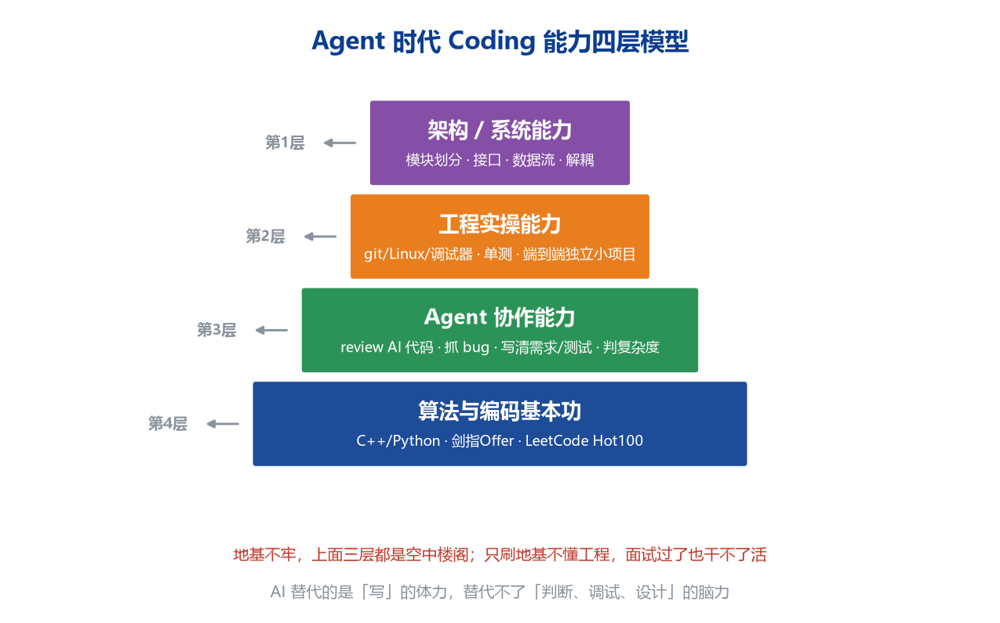
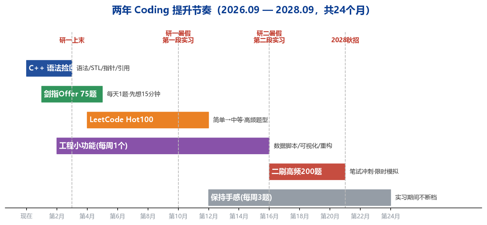

# 两年作战地图与 Coding 提升指南（2029 届定制版）

报告日期：2026 年 9 月 27 日
适用对象：东北大学电子信息硕士（三年制，2029 届）
目标：2028 秋招拿下头部智驾公司算法 offer，路径 Momenta → 第二段实习 → return offer

---

## 一、你的真实背景档案

| 项目 | 情况 | 战略含义 |
|------|------|---------|
| 学校/专业 | 东北大学 电子信息 硕士 | ==985 硬门槛已过==，Momenta/小马/NVIDIA 不会因学历刷你 |
| 学制 | 三年制，2029 届毕业 | 秋招在 2028 秋，有完整两年准备 + 两段实习窗口 |
| 年龄 | 2000.12 生，毕业时 28 岁 | 容错率低，不能 gap/延毕，每步走对；但工作经历是优势 |
| 英语 | 六级 465 | NVIDIA 英文技术面的障碍，需 1-2 年持续补听说 |
| 工作经历 | 读研前在华为车 BU（现引望） | ==简历上最被低估的牌==，证明量产流程经验 + 转行决心 |
| 代表项目 | 多车型归一化测试工具开发 | 本质是异构接口抽象/数据归一，可对标量产数据平台 |
| 硕士课题 | 拉曼光学系统（含分类/分割） | 与智驾不对口，是最大结构性约束，需主动改造 |
| 算法现状 | 能跑通 demo，shape bug 需 AI 修 | 工程 coding 是当前最大短板 |

### 1.1 两张好牌

1. **985 硕士 + 华为车 BU**：学历过线 + 量产背景稀缺。在华为车 BU 待过意味着你懂车规级协作流程，不是纯学生；从车 BU 出来读研又回到智驾，职业逻辑自洽。
2. **多车型归一化工具项目**：不要写成"写测试脚本"。它的技术内核是"异构车型接口 → 统一数据中间层 → 工具化"，与自动驾驶多传感器标定归一化、量产数据闭环同源。

简历表述模板：

```
主导/参与多车型测试数据归一化工具开发，将 N 款车型异构接口
抽象为统一数据层，覆盖 XX 车型，测试效率提升 XX%；
技术栈 Python/C++，涉及接口抽象、数据校验与自动化流程。
```

### 1.2 三个约束与对策

1. **课题不对口**：主动把课题里的分类/分割切到深度学习上——用 CNN/Transformer 做拉曼光谱分类或成分分割。==用同一套 PyTorch 能力同时满足毕业和求职==，这是你能做的最划算的一件事。
2. **实习放人问题**：本学期内必须摸清导师对研一暑假实习的态度，这是全部计划的前提。
3. **英语 465**：每天 20 分钟技术英语（听 GTC 演讲、用英文复述自己的项目），2028 年初达到能用英文做技术对话，而不是去考雅思。

---

## 二、SWOT 定位

- 优势 S：985、车厂量产经验、行业认知和人脉（25 岁架构师）、学习自驱力强
- 劣势 W：==coding 工程能力弱、课题不对口、英语听说弱、无顶会论文==
- 机会 O：BEV/端到端/VLA 人才缺口大、2027-2028 暑期实习窗口、车机不分家的具身风口
- 威胁 T：竞争者中有顶会论文/竞赛获奖者；28 岁应届容错率低

核心战略：==用车厂经验差异化，用两年 coding 补短板，用两段实习换 return offer==。

---

## 三、2029 届完整时间线（精确到学期）

```
2026.09–2027.01  研一上
  · P1：BEV 底座跑通训练；课题切深度学习分类/分割
  · C++ 捡回 + 剑指Offer 启动；摸导师实习口风

2027.02–2027.06  研一下
  · P2：Camera+LiDAR 融合，nuScenes 真实数据出 mAP
  · 3–5 月投递暑期实习（Momenta 主力，小马/元戎/理想同投）
  · 简历主卖点 = 华为车 BU + nuScenes 项目

2027.07–2027.09  研一暑假 ★第一段实习
  · 优先进端到端/BEV/世界模型组，避开边角模块
  · 在职补 C++/CUDA，用英文讲项目

2027.09–2028.01  研二上
  · 延续实习或回校推进课题；P3：VLA/世界模型复现
  · 保持每周 3 题手感

2028.02–2028.06  研二暑假 ★第二段实习
  · 冲刺 NVIDIA DRIVE（C++/CUDA/英语）
  · 主力小马世界模型/端到端、元戎、文远
  · 内推老哥的 LiDAR+VLA / 具身团队
  · 核心目标 = return offer

2028.07–2028.10  2029 届秋招
  · 带两段实习 + return offer 谈，议价权最大

2029.06  毕业（28 岁前）
```

关键提醒：==选实习组比选公司更重要==。第一段进端到端/世界模型核心组，直接决定第二段能跳多高。

---

## 四、先回答你最焦虑的问题：Agent 时代还需要刷题吗



### 4.1 结论先行

==AI 替代的是"写代码"的体力，替代不了"判断、调试、设计"的脑力。== 剑指 Offer 要看，LeetCode 要刷，但目的和刷法在 2026 年都变了。

三个无法回避的事实：

1. **笔试/面试现场不能用 Agent**。Momenta、小马、华为都有机考和现场手撕，NVIDIA 还要用英文写。这是硬门槛，绕不过去。
2. **你要能 review AI 写的代码**。看不出 bug、判断不了复杂度、发现不了边界问题，Agent 只会让你更快地产出错误代码——你在华为"重复造轮子导致能力退化"，本质就是长期只协作不拥有，Agent 时代这个风险更大。
3. **架构和调试是 Agent 最弱的环节**，恰恰是资深工程师的核心价值，也是你要刻意练的东西。

### 4.2 剑指 Offer 该不该看？——该，而且优先看

理由：

- 它是中国大厂笔面试的"母题库"，75 道题覆盖最高频套路
- 题量小而精，适合你这种时间紧、基础弱的人，性价比最高
- 顺序：先用它建套路库，再上 LeetCode 拓展

正确刷法（==不要看答案背代码==）：

```
第 1 步：读题后自己想 15 分钟，能写暴力解也先写
第 2 步：卡住再看题解，理解"为什么用这个套路"
第 3 步：第二天闭卷默写一遍（不是抄，是重写）
第 4 步：一周后重做，能在 20 分钟内 bug-free 才算过
```

### 4.3 LeetCode 该不该刷？——该，但不搞题海

- ==刷 Hot 100 就够，不追求 1000 题==。面试官考的是套路识别，不是题量
- 语言用 C++（智驾岗要求），Python 辅助
- 题型优先级（按智驾笔试频率）：

| 优先级 | 题型 | 说明 |
|-------|------|------|
| P0 | 数组/字符串/哈希表 | 每场必考，性价比最高 |
| P0 | 双指针/滑动窗口 | 套路固定，必须秒出 |
| P0 | 链表 | 反转/环/合并，送分题不能丢 |
| P1 | 二叉树/DFS/BFS | 递归思维的核心训练 |
| P1 | 二分查找/栈/队列 | 边界处理练手 |
| P2 | 动态规划 | 难，但大厂必考一两道 |
| P2 | 回溯/贪心 | 掌握模板即可 |

- 量化目标：==Hot100 中等题能在 25 分钟内独立写出无 bug 代码==，并说清时间/空间复杂度

### 4.4 怎么锻炼算法思路（不是背答案）

每道题强制走"五步"，建立模式识别而不是记忆：

```
1. 读懂题，先写最朴素的暴力解（保证正确）
2. 找暴力解的瓶颈在哪（重复计算？无序查找？）
3. 匹配数据结构/套路（要快速查找→哈希；要去重有序→双指针）
4. 写代码，手动跑一个简单用例 + 一个边界用例
5. 分析时间/空间复杂度，追问"还能不能更优"
```

每题结束做"三问归档"：这题属于什么套路？关键观察是什么？我卡在哪？用一个自己的笔记文件积累，==复习时看的是"套路索引"而不是题目==。

费曼检验：讲不清楚的题就是没懂，直到你能给同学口述每一步为什么。

---

## 五、Agent 时代的正确用法（关键中的关键）

| 场景 | 正确做法 | 错误做法 |
|------|---------|---------|
| 刷算法题 | 先自己写完，再让 Agent 找 bug、问复杂度、要更优解 | 直接让它给答案抄上去 |
| 写工程代码 | 核心数据流/接口自己先画图，再让 Agent 填细节 | 复制粘贴不看，能跑就行 |
| 学习 | 让 Agent 出变体题、模拟面试官追问边界 | 让它替你思考 |
| Debug | 自己读报错定位 10-20 分钟，再用它验证思路 | 一报错就全丢给它 |

一句话：==把 Agent 当 reviewer 和陪练，不要当拐杖。面试是裸 coding，拐杖会被收走。==

你在华为能力退化的根因是"长期参与协作但没有端到端拥有过一个东西"。解药不是多上班，而是在课外拥有 full ownership 的小项目——从需求、设计、编码、测试到 README 全部自己完成。

---

## 六、两年 Coding 节奏



每日/每周固定量（雷打不动）：

- 工作日：1 道题（45 分钟）+ C++ 30 分钟
- 周末：1 个工程小功能 + 本周题目复盘重做
- 实习期间：降级为每周 3 题保持手感，不断档即可

工程练习按 5 级难度爬坡（==这是把"能做题"变成"能干活"的桥梁==）：

```
L1 数据脚本：自己写 nuScenes 数据读取、坐标转换、可视化
L2 给项目加功能：checkpoint 保存、日志、评估指标、配置管理
L3 从零实现模块：不看现有代码默写 SCA / Dataset / Loss
L4 重写华为归一化工具：自己设计接口和架构，全程独立 owner
L5 完整小系统：带单元测试、README、规范 git 提交的小作品
```

L4 尤其重要：把你在华为只"参与"过的工具，趁读研自己从零设计实现一遍——==既恢复 coding 信心，又把工作经历从"参与者"改写成"能独立设计者"==。

---

## 七、怎么培养架构意识

架构不是背设计模式背出来的，是从"读、拆、写、重构"四件事里长出来的：

1. **读成熟工程**：读 mmdet3d 时画模块依赖图和数据流图（你梳理 BEV 项目的练习就是架构训练，继续保持）
2. **拆任何系统先问四个问题**：输入输出契约是什么？模块边界在哪？数据怎么流动？异常怎么处理？
3. **写端到端小项目**：full ownership 是根治"螺丝钉视角"的唯一办法
4. **重构自己的代码**：每周把上周写的代码拿出来批——哪里重复了？哪里耦合了？哪里没法测试？
5. **先只守三个原则**：单一职责（一个函数只干一件事）、接口清晰（输入输出约定明确）、不要过早抽象（先跑通再优化）

设计模式书（GoF）现在不用啃，等你写了 5000 行自己的代码、被耦合坑过几次，再看会秒懂；现在看只会背名词。

---

## 八、两年后的简历目标骨架

```
教育  东北大学 电子信息 硕士 2029（985）
工作  华为车 BU（引望）
      └ 多车型归一化测试工具：异构接口统一数据层（Python/C++）
实习1 Momenta/小马 端到端或 BEV 感知组（2027 夏）
实习2 NVIDIA DRIVE / 小马世界模型组（2028 夏，争取转正）
项目1 Camera+LiDAR BEV 融合，nuScenes mAP=XX
项目2 世界模型/VLA 复现，CARLA 闭环验证
项目3 深度学习拉曼光谱分类/分割（对接毕业课题）
技能  PyTorch · C++ · CUDA 入门 · git/Linux · 英文可技术交流
刷题  剑指Offer 75 + LeetCode Hot100 二刷
```

这个组合 = 985 + 量产经验 + 两段前沿实习 + 对口项目，在 2029 届算法岗里属于强竞争力简历。

---

## 九、本月（2026.10）行动清单

- [ ] 跑通 training/train.py，看到 loss 下降，截图存档
- [ ] C++ 环境搭好（VS Code + g++），过完语法和 STL 基础
- [ ] 剑指 Offer 开始，每天 1 题，建"套路索引"笔记
- [ ] 找导师谈：课题能否切深度学习 + 研一暑假实习放人
- [ ] 每天 20 分钟技术英语（GTC 视频 + 英文复述项目）
- [ ] 重新梳理华为归一化项目，写成 STAR 格式简历素材

---

## 十、最后几句实话

你不是"代码天赋差"，是过去几年在大公司分工里被剥夺了端到端写代码的机会——==这是环境问题，不是能力问题，用两年有针对性的训练完全补得回来==。

Agent 不会让程序员失业，但会让"不会判断、不会调试、不会设计"的人失业。你要做的恰恰是 Agent 最不擅长的那部分：看懂原理、独立 debug、设计架构。这些能力从明天的第一道剑指 Offer、第一次自己修 shape bug 开始长。

28 岁毕业不晚，前提是从现在起的每一步都算数。
