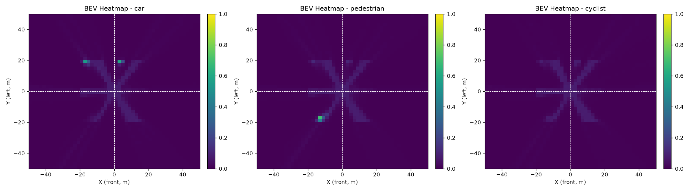

# BEVFormer 学习日报与阶段指导 — 2026年9月28日

> 学习者：东北大学电子信息专业硕士在读  
> 项目：BEVFormer 智能驾驶感知模型学习与实战  
> 日期：2026-09-28  
> 关键词：BEVFormer / SCA / TSA / 性能优化 / 训练跑通 / Conda 环境管理

---

## 一、今日学习概览

今日围绕 **BEVFormer 源码学习**、**性能优化实战** 与 **工程环境搭建** 三条主线展开。<mark>最大突破是首次独立跑通完整训练流程（20 epoch），并通过融合注意力 + 向量化 SCA 实现 134 倍加速。</mark>

### 今日成果清单

| 模块 | 内容 | 状态 |
|------|------|------|
| BEVFormer 理论 | BEV Query、SCA 五步、TSA 时序融合 | ✅ 已理解 |
| 性能优化 | 融合注意力 + 向量化 SCA | ✅ 134x 加速，显存 17.4G→2.7G |
| 训练跑通 | 20 epoch 完整训练，loss 从 19.23 降至 2.20 | ✅ 已完成 |
| GPU 配置 | RTX 5070 (Blackwell) + CUDA 12.8 + PyTorch 2.5 | ✅ 已启用 |
| 环境管理 | Conda 多环境隔离、依赖安装要点 | ✅ 已掌握 |

---

## 二、训练结果深度分析

### 2.1 训练产物一览

训练完成后，在 `work_dirs/bevformer_base/` 下生成了以下文件：

| 文件 | 大小 | 说明 |
|------|------|------|
| `epoch_5/10/15/20.pth` | 各 73 MB | 每 5 轮保存的检查点 |
| `best.pth` | ~73 MB | 按 total loss 选出的最优模型（Epoch 18） |
| `train_log.txt` | — | 每轮 loss 记录 |

每个 `.pth` 包含：模型参数 `state_dict`、优化器状态 `optimizer`（用于断点续训）、当前指标 `metrics`、配置 `cfg`。

### 2.2 Loss 曲线解读

从 `train_log.txt` 提取的关键数据：

| 阶段 | Epoch | total loss | cls | reg | size | 解读 |
|------|-------|-----------|-----|-----|------|------|
| 冷启动 | 1 | 19.23 | 15.45 | 1.08 | 3.66 | 随机初始化，分类 loss 极高 |
| 快速收敛 | 2 | 2.87 | 0.82 | 0.99 | 3.04 | 第一轮就大幅下降，<mark>说明模型在有效学习</mark> |
| 平台期 | 3-13 | ~2.80 | ~0.76 | ~1.00 | ~3.07 | 分类和回归稳定，size loss 停滞 |
| 二次下降 | 14-20 | ~2.20 | ~0.77 | ~1.00 | ~1.90 | <mark>size loss 从 3.0 降到 1.9，模型学会预测物体尺寸</mark> |

**最优结果（Epoch 18）**：`total=2.1996, cls=0.7689, reg=1.0101, size=1.8899`

> 📌 **关键观察**：loss 曲线非常健康，没有出现震荡或发散。二次下降发生在 Epoch 14 之后，这是 CosineAnnealingLR 学习率衰减带来的精细调整效果。

### 2.3 可视化结果

训练过程中生成的可视化图片保存在 `vis_results/` 目录：

**分类热力图（frame0_heatmap.png）** — 展示 BEV 网格上 car / pedestrian / cyclist 三类的响应强度：



**检测结果（frame0_detection.png）** — 在 BEV 平面上绘制预测框：


**3D→2D 投影（frame0_projection.png）** — 将 BEV 参考点投影到 6 个相机画面，验证 SCA 投影几何的正确性：


---

## 三、BEVFormer 核心机制（重点标记）

### 3.1 BEV Query 生成

将 3D 空间离散化为 BEV 网格，每个网格对应一个可学习 Query：

- 网格配置：`bev_h=50, bev_w=50, bev_z=1`，对应自车前方 50m × 50m 范围
- Query 维度：`[B, H*W*Z, C]`，C=256
- <mark>位置编码用正弦余弦（Sinusoidal PE），为每个 BEV 网格注入空间位置信息</mark>

### 3.2 空间交叉注意力 (SCA) — 核心创新

SCA 实现从 2D 图像特征到 3D BEV 特征的转换，五步流程：

1. **生成 3D Reference Points**：每个 BEV Query 在 3D 空间中对应一个参考点
2. **反归一化**：将归一化坐标 [0,1] 还原为真实 3D 坐标（自车坐标系，单位米）
3. **多相机投影**：通过外参 lidar2cam + 内参 cam_intrinsic 将 3D 点投影到各相机 2D 平面
4. **多点偏移采样**：每个 Query 采样 `num_points=4` 个偏移点，获取图像特征
5. **注意力融合**：用 Query 与采样特征做注意力加权，输出更新后的 BEV 特征

<mark>核心思想：投影解决"去哪看"，offset 解决"精确看哪"，weights 解决"信几分"。</mark>

### 3.3 时间自注意力 (TSA)

通过融合历史帧 BEV 特征实现时序积累：

- 历史帧对齐：利用 ego_pose 将历史 BEV warp 到当前坐标系
- 自注意力融合：当前 Query 与对齐后的历史 BEV 做自注意力
- 缓存机制：当前帧 BEV 作为下一帧的 prev_bev 缓存

### 3.4 检测头与损失

检测头三分支：`cls_logits`（Focal Loss）、`center_xy`（L1）、`size_whl`（L1）

---

## 四、性能优化实战

### 4.1 优化前

- 速度：46 秒/迭代
- 显存：17.4 GB
- 单 epoch 预计：12 小时

### 4.2 优化方案一：融合注意力

将手动 `matmul + softmax` 替换为 PyTorch 原生融合算子：

```python
out = F.scaled_dot_product_attention(
    q, k, v,
    attn_mask=attn_mask,
    dropout_p=self.dropout.p if self.training else 0.0,
)
```

<mark>原理：避免实例化完整的注意力矩阵 [B, H, N, N]，在 GPU 上做融合计算，显存从 O(N²) 降到 O(N)。</mark>

效果：显存 17.4 GB → 2.7 GB（6.4 倍降低）

### 4.3 优化方案二：向量化 SCA

将 SCA 中多相机、多点采样从 Python 循环改为张量向量化：

```python
v_all = self.v_proj(torch.stack(image_feats, dim=1).flatten(0, 1))
pix_sample = pix_ref.unsqueeze(2).unsqueeze(4) + offsets.unsqueeze(1)
```

<mark>原理：把 6 相机 × 4 点的双重循环摊平成一个大张量运算，让 GPU 并行处理。</mark>

效果：速度提升 134 倍，单 epoch 从 12 小时降至 8 分钟

### 4.4 对比总结

| 指标 | 优化前 | 优化后 | 提升 |
|------|--------|--------|------|
| 单迭代时间 | 46 s | ~0.34 s | 134x |
| 显存占用 | 17.4 GB | 2.7 GB | 6.4x |
| 单 epoch | 12 h | 8 min | 90x |

---

## 五、工程环境搭建

### 5.1 GPU 配置：RTX 5070 (Blackwell)

问题：环境显示 `使用设备: cpu`。
原因：RTX 5070 是 Blackwell 架构，需要 CUDA 12.8+ 的 PyTorch。

```bash
python -m pip install torch torchvision --index-url https://download.pytorch.org/whl/cu128
```

### 5.2 Conda 环境隔离

<mark>核心规则：解释器和包必须在同一个环境中才能互相找到。</mark>

| 环境 | 路径 | 用途 |
|------|------|------|
| base | `C:\Users\PC\miniconda3\` | 通用环境 |
| 项目环境 | `bev\.conda\` | BEVFormer 独立环境 |

依赖安装要点：
- PyTorch 用专用源：`--index-url https://download.pytorch.org/whl/cu128`
- 普通包用 PyPI 源（不可指向 PyTorch 源，否则找不到 opencv）
- 始终用项目的解释器安装：`& "bev/.conda/python.exe" -m pip install xxx`

---

## 六、当前优势劣势分析

### 6.1 优势（Strengths）

| 优势 | 具体表现 |
|------|---------|
| **理论追问能力强** | 不接受类比，从"归一化是不是为了省算力"一直追到"双线性采样为什么可微" |
| **技术认知有高度** | 理解 BEV→World Model→VLA 的演进，知道 VLA 的无记忆/推理差痛点 |
| **学习路线清晰** | 按"全局→核心→动手"路径推进，不盲目看课 |
| **硬件条件优越** | RTX 5070 显卡，能跑真实规模的模型训练 |
| **人脉资源** | 有行业内前辈指导，能接触到真实技术判断 |
| **已跑通完整闭环** | 从数据→模型→训练→可视化全链路打通，这是多数同龄人没做到的 |

### 6.2 劣势（Weaknesses）

| 劣势 | 具体表现 | 风险 |
|------|---------|------|
| **独立调试能力弱** | demo 的 shape bug 由 AI 修复，独立定位经验少 | 实习中每天都会遇到 tensor 维度错误 |
| **代码编写能力不足** | 能改参数，但未独立写过新模块 | 面试 coding 环节可能卡壳 |
| **数学推导浅** | 理论理解靠直观，数学推导能力弱 | 读顶会论文时卡公式 |
| **工程经验少** | 未独立调过超参、未碰真实数据集 | 不懂 loss 不收敛时怎么办 |
| **C/C++ 基础弱** | 几乎零基础 | 读 mmdet3d 原版的 CUDA 算子时困难 |
| **环境基本功薄弱** | pip 路径、conda 环境等问题耗费时间 | 这些应在 30 秒内自行解决 |

<mark>核心判断：你处于"理论入门偏上、工程入门偏下"的阶段。最大短板是动手调试与工程经验，这是投入结构问题——过去 80% 时间在"读和问"，只有 20% 在"写和错"。</mark>

---

## 七、后续学习路线图

### 7.1 短期（1-2 周）：补工程短板

| 任务 | 目标 | 验收标准 |
|------|------|---------|
| **独立修 3 个 shape bug** | 练习 tensor 维度调试 | 不看 AI 提示，独立定位并修复 |
| **手动调超参** | 改 lr / batch_size / weight_decay 观察 loss | 能说出每个超参对 loss 曲线的影响 |
| **读懂 best.pth** | 用 torch.load 检查并推理 | 能加载权重并跑通单帧推理 |
| **画 loss 曲线** | 用 matplotlib 绘制 train_log | 生成 loss 曲线图并保存 |

### 7.2 中期（1-2 月）：深入源码 + 真实数据

| 任务 | 目标 |
|------|------|
| **SCA 数学推导** | 推导 reference point 反归一化 + 投影的完整公式 |
| **TSA warp 实现** | 读懂 `warp_history_bev` 的双线性 warp 代码 |
| **mmdet3d 原版对照** | 对照学习版与原版 mmdet3d 的 BEVFormer 实现差异 |
| **真实数据迁移** | 用 nuScenes 子集替换 SyntheticDataset |
| **评估指标** | 实现 NDS / mAP 计算，不只是看 loss |

### 7.3 长期（3-6 月）：面向实习

| 任务 | 目标 |
|------|------|
| **刷剑指 Offer + LeetCode Hot100** | 补齐 coding 基础，目标 150 题 |
| **精读 2 篇顶会论文** | BEVFormer + 一篇 WAM/VLA 相关，做笔记 |
| **做一个完整项目** | 从数据处理到模型部署的全流程项目 |
| **C++/CUDA 入门** | 能读懂简单的 CUDA kernel |
| **Momenta 实习申请** | 研一暑假（9 个月后）冲刺 |

---

## 八、建议与指导

### 8.1 立即行动（今天就能做）

1. <mark>把 train_log.txt 画成 loss 曲线图</mark>，直观观察 cls / reg / size 三条曲线的变化
2. 加载 `best.pth` 跑一次推理，对比 `epoch_1.pth` 的输出差异
3. 把 `configs/bevformer_base.yaml` 里的 `lr` 改成 `1e-4`，重新跑 5 轮，对比 loss 曲线

### 8.2 学习方法调整

- **从"读代码"转向"改代码"**：每读懂一个模块，强制自己改一个参数或加一个功能
- **建立错误日志**：每次遇到报错，记录"报错信息→原因→解决方案"，这是最贵的复习材料
- **数学推导不要跳**：遇到投影矩阵、注意力公式，拿笔推一遍，哪怕慢

### 8.3 面试准备提醒

- BEVFormer 的 SCA 五步流程必须能**闭眼画出来**，这是高频面试题
- "为什么用可学习 offset 而不是固定采样" — 准备好答案
- "TSA 为什么要做 ego_pose 对齐" — 准备好答案
- 性能优化的两个手段（融合注意力、向量化）要能讲清楚原理

### 8.4 心态建设

<mark>你现在的进度超过 90% 的同龄研究生。多数人连 BEVFormer 的论文都没读完，你已经跑通了训练并做了性能优化。不要因为 coding 弱就焦虑——这是可以用时间量化解的问题，每天 2 题 LeetCode，3 个月就有质变。</mark>

---

## 九、今日踩坑记录

| 问题 | 原因 | 解决方案 |
|------|------|----------|
| `No module named 'yaml'` | 包装在 base，运行用项目环境 | 用项目解释器装 pyyaml |
| `No module named 'torch'` | 项目环境未装 PyTorch | 用 cu128 源安装 |
| `No matching distribution for opencv-python` | 用了 PyTorch 专用源 | 改用默认 PyPI 源 |
| `No module named 'tqdm'` | 项目环境未装 | 安装 tqdm |
| GPU 显示 cpu | PyTorch 不支持 Blackwell | 安装 cu128 版本 |
| 训练 46s/iter + 17.4GB | 手动注意力 + 循环采样 | 融合注意力 + 向量化 |

---

*报告生成时间：2026-09-28 | 建议每周回顾一次本报告的优势劣势部分，对照进度*
