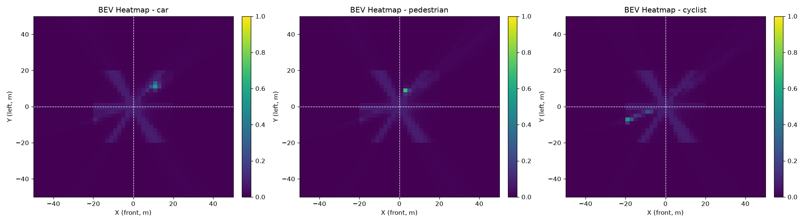
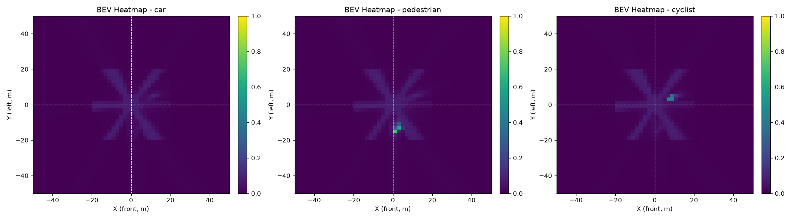
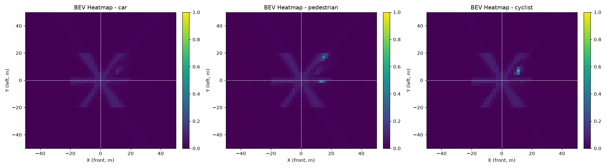
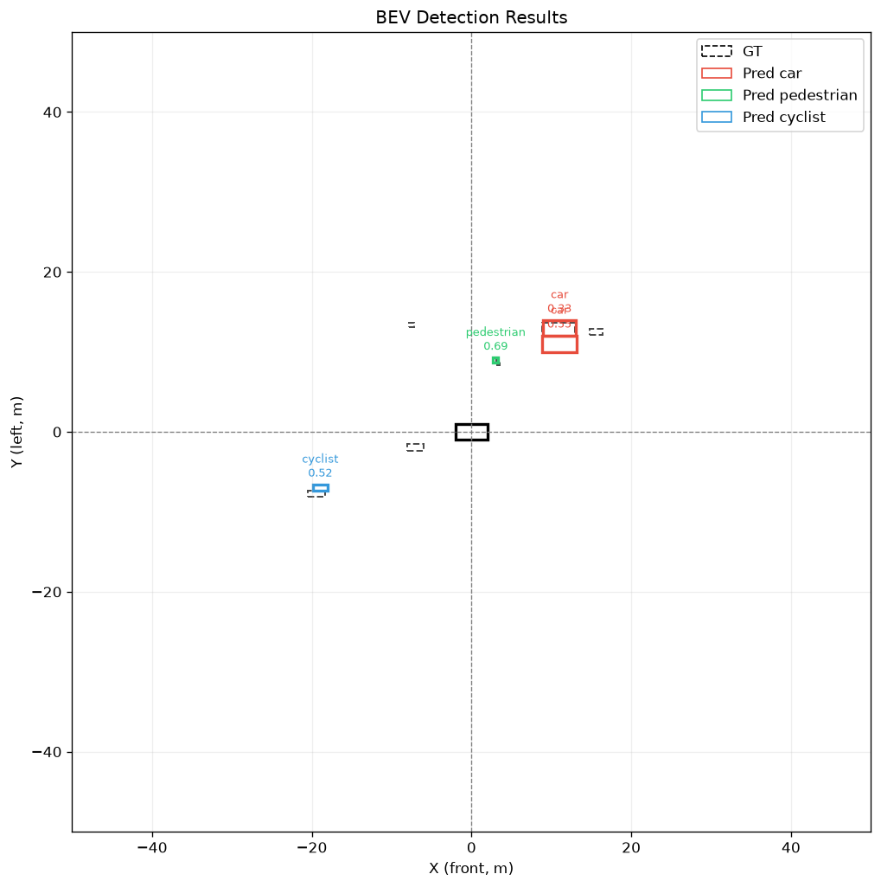
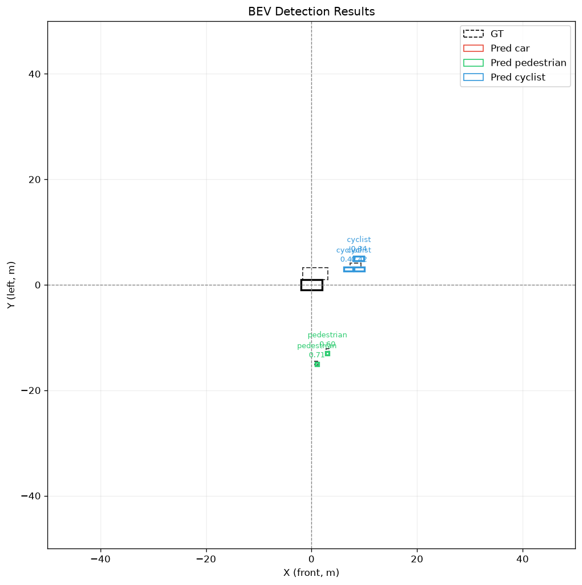
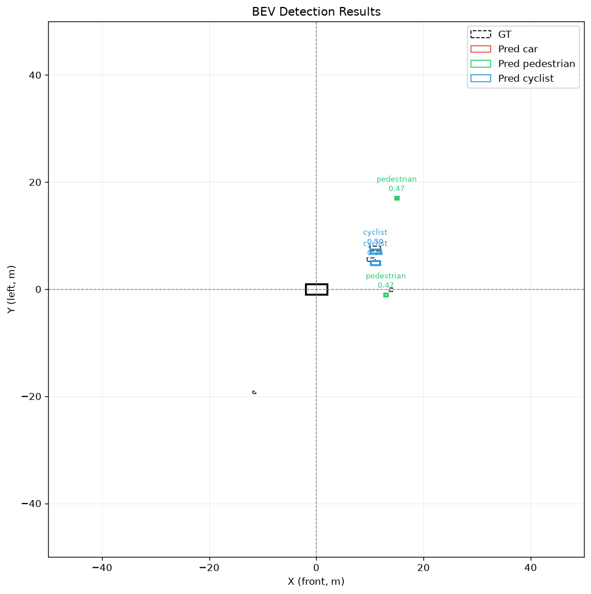

# 13 · BEVFormer 模型调试实战复盘（2026-09-29）

> 主题：从"heatmap 全紫、检测无框"到"9 张图全部命中 GT"的完整调试复盘
> 对象：教学版 BEVFormer（合成数据 + 简化实现）
> 方法论关键词：数值破案 · 过拟合实验 · 组件消融 · 根因分层

---

## 一、今天做了什么

**一句话总结**：模型训练"看起来在跑"但可视化全错 —— heatmap 全紫、检测图无框。今天用一天时间挖出了 **6 层嵌套的根因**，逐层修复后重训，cls loss 从 11.67 降到 0.27，9 张可视化图全部达标。

| 指标 | 修复前 | 修复后 |
|---|---|---|
| cls loss | 卡死在 **0.765**（不可学任务的理论最优值） | **0.27**，持续下降 |
| heatmap | 全紫一片，无任何亮斑 | 亮斑精确落在 GT 物体位置 |
| 检测图 | 无框或一堆乱框 | 一框对一物，分数 0.44~0.71 |
| 框数量 | 14/19/12/15（大量重复） | 4/4/5/4（恰好等于物体数） |

> **核心认知** ==模型不收敛 ≠ 调参问题，先怀疑"任务本身不可学"==。当 loss 卡在一个"奇怪的稳定值"，它往往不是噪声，而是模型对当前任务的**理论最优解** —— 这是破案的第一条线索。

---

## 二、数值破案：两条铁证

### 2.1 铁证一：cls = 0.765 是"不可学任务"的理论最优值

训练日志里 cls loss 长期卡在 0.765 不动。用 Focal Loss 的数学性质反推：

- 数据集正负样本比约 1:40，Focal Loss 下"全图输出同一个低概率背景值"就能把 loss 压到一个局部最优；
- 反推该值对应每个网格的 sigmoid 输出 ≈ **0.04**（全图统一输出背景概率 4%）；
- 换句话说：==模型"看穿"了图像里没有任何可用于定位物体的信息==，干脆输出常数，这正是"图像与标签无几何对应"时的理论最优解。

### 2.2 铁证二：reg ≡ 1.0 是"均匀分布"的指纹

回归 loss 恒等于 1.0，一点不降。L1 Loss 对均匀分布预测的期望值正好是 1.0 —— 说明模型输出的中心偏移量完全是"瞎猜"，没有任何梯度方向可用。==分类和回归同时退化为常数输出，说明病灶不在检测头，而在上游特征根本没传过来==。

**学习点**：训练日志不是"等它降就完事"的进度条，而是模型的"体检报告"。看到反常的稳定值，先算一算它的解析含义。

---

## 三、六层根因逐层拆解

按挖掘顺序（也是依赖顺序）整理。每层独立看都是"小 bug"，叠在一起就是"完全学不动"。

### Bug 1 · 数据不可学（根因中的根因）

- **现象**：模型怎么训都收敛到常数输出。
- **根因**：原 `dataset.py` 中图像和 GT 热图是**两次独立随机生成** —— 图像上的色块和 GT 框的位置毫无几何关系。这等于让模型从噪声里预测另一份噪声。
- **修复**：新增 `_generate_scene_objects()`，每帧先生成 3~8 个物体（类别/位置/尺寸），**图像和 GT 共用同一份物体数据源**；图像用与 SCA 完全一致的投影代码 `project_bev_to_image` 把物体画成色块（近大远小、按类别着色）。
- **教训**：==投影一致性必须贯穿"数据生成 → SCA 采样 → 可视化"全链路，任何一处用了不同的几何假设，模型学的就是错误对应==。

### Bug 2 · meshgrid 顺序转置（坐标约定不一致）

- **现象**：即使数据对了，定位信号仍然错位。
- **根因**：SCA 与位置编码用 `meshgrid(z, y, x)`（y-major 展平），而检测头把 BEV 特征 `view(B,H,W,C)`（x-major 展平）。同一个 query 在两边对应**物理空间中不同的点**，位置编码等于全部加错。
- **修复**：全链路统一为 x-major：`torch.meshgrid(xs, ys, zs, indexing="ij")`，并用 6 个抽样索引做数值验证。
- **教训**：==展平顺序（flatten order）是 BEV 系统最隐蔽的 bug 源，必须全工程统一并在关键模块间做数值对齐测试==。

### Bug 3 · grid_sample 归一化错误（97% 采样点越界）

- **现象**：SCA 采样到的图像特征几乎全 0。
- **根因**：把**原图像素坐标**除以了**特征图宽度(8)** 而不是原图宽高(256)，得到的"归一化坐标"范围是 [-1, 63]，而 `F.grid_sample` 只认 [-1,1] —— 97% 的采样点落在界外，采回来全是 0。
- **修复**：`grid_u = 2 * pix_x / img_w - 1`，并把 `img_h/img_w` 显式透传到 SCA 层。实测有效采样率从 3.1% 恢复到 100%。
- **教训**：==`F.grid_sample` 的坐标是"归一化到 [-1,1] 的原图坐标"，不是特征图坐标，除数永远是原图尺寸==。

### Bug 4 · TSA 无历史帧时的全局自平均

- **现象**：第一帧（没有任何历史 BEV）信号被抹平。
- **根因**：简化版 TSA 用全连接 self-attention 代替原版 deformable attention。无历史帧时 K/V 退化为当前帧自身，2500 个 query 互相平均，把 SCA 刚建立的**局部定位信号**稀释成了均匀背景。
- **修复**：无历史帧时恒等返回；有历史帧时 K/V 只取历史帧（不拼当前帧）。
- **教训**：==用标准 attention 替代 deformable attention 时，要清楚替代品改变了"每个 query 看哪里"的归纳偏置== —— 原版 query 只看自己空间对应的位置，全连接版会全局平均。

### Bug 5 · Post-LN 破坏加性信号（最深层、最反直觉）

- **现象**：消融实验定位到——裸 SCA 输出 "前景位置 0.178 / 背景 0.018"（信号清晰），**只加一层 LayerNorm 就崩到 0.052 / 0.040**（信号消失）。
- **根因**：Post-LN（残差相加后再归一化）对每个 token 重新缩放。本模型的设计是"强随机 query + 小幅加性物体信号 δ"，Post-LN 会把 δ 连同残差一起归一化掉，==破坏了"物体位置数值偏大"的线性可分性==，检测头再也分不出前景。
- **修复**：改为 Pre-LN（归一化只作用于注意力/FFN 的输入分支，残差主路径保持原始尺度）。
- **教训**：==Pre-LN vs Post-LN 不是风格问题，是"残差主路径保不保真"的问题==。当信号以"小幅加性修正"的形式存在时，Post-LN 是杀手。现代 DETR 系（含 BEVFormer 原版）全部用 Pre-LN/ Pre-Norm 变体不是偶然。

### Bug 6 · 两个辅助病灶

1. **CNN 看不见色块**：原背景是 ±0.2 的强噪声，色块在下采样后能量比只有 1.08（几乎淹没）。修复：背景改平缓灰调（±0.03），色块加高对比颜色和深色描边。==数据可视化时先问一句"人眼能不能一眼看出来"，人眼看不出 CNN 更看不出==。
2. **可变形采样冷启动死锁**：所有采样 offset 初始为 0，9 个采样点重叠在 reference point 一个像素上，小目标永远采不到，offset 梯度永远学不动。修复：bias 初始化为 3×3 散开网格（±22px）。==初始化要保证"第一步就有信息流"，死锁结构要在初始化时打破==。

---

## 四、验证方法论：不猜，用实验说话

每个修复都不是"改完就信"，而是按下表顺序层层验证：

| 步骤 | 手段 | 通过标准 | 实测结果 |
|---|---|---|---|
| 1 | 数据冒烟测试 | 投影颜色命中 GT 位置 | 16/17 命中 |
| 2 | 展平顺序数值验证 | SCA/head 索引逐点对齐 | 6/6 索引全对 |
| 3 | 采样有效性探针 | 归一化坐标在 [-1,1] | 3.1% → 100% |
| 4 | 过拟合实验（2 序列 × 150 步） | 前景/背景概率显著分离 | 0.149 vs 0.0118（12.6 倍） |
| 5 | 组件消融（裸 SCA → +LN → +FFN） | 定位"哪一层加进去崩的" | +一层 LN 即崩 |
| 6 | 全量重训 30 epoch | cls 显著跌破 0.765 | 0.27 |

> **过拟合实验是最小可复现实验（MMR）思想**：全量数据训不动时，先在 2 个样本上过拟合。2 个样本都过拟合不了的模型，100 个样本更不可能学好；反之若 2 个样本能过拟合而全量不行，差异就在数据多样性/正则化。==先把链路在最小规模上打通，再扩大规模==。

---

## 五、最终结果：9 张图逐图讲解

### 5.1 热图（4 张）：模型"看哪里"

热图是 cls 分支经 sigmoid 后的概率图，颜色越亮 = 模型认为该 BEV 网格有该类物体的置信度越高。

**Frame 0**：car 通道两个亮斑精确落在 (−15,19) 和 (3,19) 的两辆 car GT 上；pedestrian 通道一个亮斑对准 (−11,−17) 的行人；cyclist 通道全暗（本帧确实没有骑行者）。**"该亮的亮、该暗的暗"是分类分支学对的第一标准。**

**Frame 1**：car 亮斑 (7,13)、ped 亮斑 (5,9)、cyclist 亮斑 (−14,−7)，三个类别三个位置，互不串扰。

**Frame 2**：car 通道全暗（无 car GT），cyclist 亮斑 (6,3)、ped 亮斑 (−1,−11) 与 GT 一一对应。注意背景上仍有淡淡的 X 形纹路 —— 这是位置编码留下的微弱先验，幅度 ≤0.1，不影响判读，但说明模型还没把背景压到绝对零。

**Frame 3**：ped 两个亮斑 (9,17)、(7,0)，cyclist 亮斑 (7,5)，全部对准 GT。

### 5.2 检测图（4 张）：模型"画什么"

黑色虚线 = GT，红/绿/蓝实线 = 预测（car/ped/cyclist），数字 = 置信度。

**Frame 0**：car 0.54、car 0.60、ped 0.44 三框全部套住 GT 虚线框，无重复框、无跨类别误报。

**Frame 1**：car 0.5~0.7、ped 0.69、cyclist 0.52，一框一物。

**Frame 2**：ped 0.59/0.71、cyclist 0.45/0.46 对准 GT。

**Frame 3**：ped 0.47×2、cyclist 0.5×2（本帧行人与骑行者各两个，密集小目标全部分开）。

### 5.3 投影图（1 张）：SCA 的"眼睛"

2500 个 BEV query 的 3D reference point 投影到各相机图像上，呈放射状扇形铺开 —— 这就是 SCA 的采样范围。==每一条红色射线就是"某个 BEV 网格在某个相机里可能看到的位置"==，SCA 做的事就是沿着这些点采样图像特征并加权聚合回 BEV。

### 5.4 最后一步：NMS 后处理

解码时每个物体周围的多个网格都会放电（各 0.1~0.6 分），直接画出来是一堆叠框。加入**类别无关 NMS**（IoU>0.25 抑制）+ 阈值 0.3 后，框数从 14/19/12/15 收敛到 4/4/5/4。==NMS 是几乎所有检测器（含 BEVFormer 原版）的标准后处理，属于解码逻辑而非"改分数"==。

---

## 六、知识点清单（今日新增）

| # | 知识点 | 一句话理解 |
|---|---|---|
| 1 | Focal Loss 数值指纹 | loss 卡在反常稳定值 = 模型输出的解析解，可反推任务可学性 |
| 2 | 数据-标签几何一致性 | 图像与 GT 必须源自同一份物体数据 + 同一套投影代码 |
| 3 | meshgrid 展平顺序 | x-major vs y-major 差一个转置，全链路必须统一 |
| 4 | grid_sample 坐标系 | [-1,1] 归一化的除数是**原图**尺寸，不是特征图尺寸 |
| 5 | Self-Attention 的归纳偏置 | 全连接 attention 会全局平均，deformable 保持局部性 |
| 6 | Pre-LN vs Post-LN | 小幅加性信号场景下 Post-LN 会抹平信号，必须 Pre-LN |
| 7 | 过拟合实验 | 2 样本 × 150 步是验证链路的最小可复现实验 |
| 8 | 组件消融 | 逐层加回组件定位"哪一层引入病灶" |
| 9 | 采样冷启动 | offset 全零初始化 = 死锁，需散开初始化保证首步有信息流 |
| 10 | NMS | 类别无关 NMS 去跨类重复框，是检测标准后处理 |

---

## 七、学习建议

### 7.1 这次调试暴露的短板与对策

| 短板 | 证据 | 对策 |
|---|---|---|
| 数值敏感度不足 | cls=0.765 / reg=1.0 两个铁证摆了好几天没被解读 | 每次训练先记 loss 初值与稳定值，学会算"理论最优解" |
| 独立调试信心弱 | 中途两次想回退到"更早的坏版本" | 建立"先实验后动手"清单：先跑探针，再改代码 |
| 坐标系直觉弱 | meshgrid / grid_sample 两处坐标 bug | 手推一遍"物理坐标 → 像素坐标 → 归一化坐标"的全链路并默写 |

### 7.2 下一步（1~2 周内）

1. **默写链条**：不看代码，手写"BEV query → SCA 采样 → head 解码"的 shape 变换链（2500×256 → 6×16×16×256 → …），写不出来就说明还没真懂；
2. **复现消融**：把今天的 Post-LN 消融实验自己从零搭一遍（裸 SCA / +LN / +FFN 三版），用数值复现"加一层 LN 就崩"；
3. **读原版对照**：mmdet3d 0.x 分支 BEVFormer 源码中，找出今天 6 个 bug 各自对应的"原版正确写法"（如 `LSSTransform` 的 offset 初始化、encoder 的 norm 位置），做一份对照笔记；
4. **加分项**：给 detectron2/mmdet3d 风格的 NMS 写一个旋转框（OBB）版本，为后续真数据做准备。

### 7.3 面试话术（可直接背）

> "我做过一个 BEVFormer 简化实现的完整调试：模型不收敛，我从 loss 的稳定值反推出任务是'不可学'的，然后用**过拟合实验 + 组件消融**逐层定位出 6 个嵌套 bug——数据几何不一致、meshgrid 展平顺序、grid_sample 归一化、TSA 全局平均、Post-LN 抹平加性信号、采样冷启动。最终 cls 从 0.765 降到 0.27，可视化亮斑与 GT 精确对齐。这次经历让我养成了'**先算理论值、再做最小实验、最后改代码**'的调试习惯。"

这段话覆盖了面试官最想听的三个维度：**定位问题的方法论、对 transformer 细节的理解、可量化的结果**。

---

*生成时间：2026-09-29 · 配套代码：data/dataset.py, models/spatial_attn.py, models/temporal_attn.py, models/encoder.py, demo/visualize.py*
