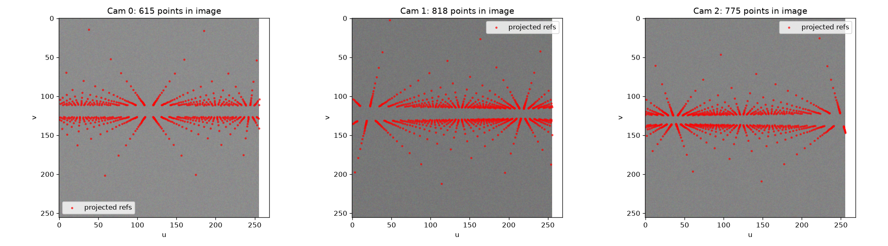
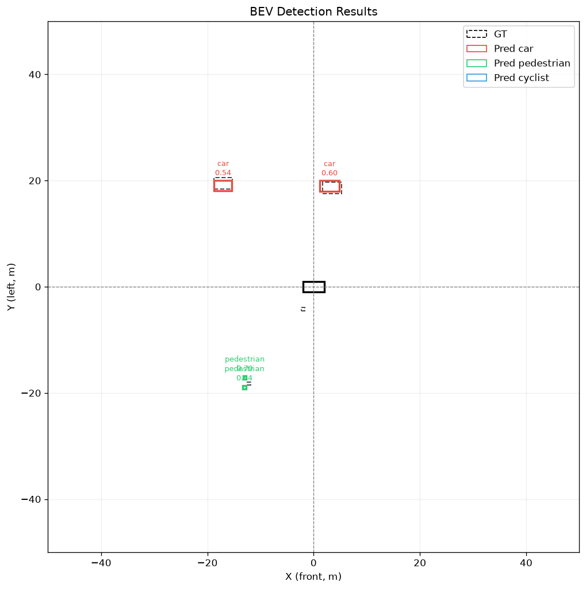

# 14 · BEVFormer 教学工程代码全解析（2026-09-29）

> 对象：本工程（合成数据 + 简化实现 BEVFormer）
> 目标：读完能默写"数据 → 模型 → 训练 → 可视化"的完整 shape 流转
> 配套：`13_BEV模型调试实战复盘`（调试视角），本文是**代码结构视角**

---

## 一、工程全景

```
bev/
├── configs/bevformer_base.yaml   # 所有超参：BEV 50x50、6相机、stride16、30 epoch
├── data/
│   ├── dataset.py                # SyntheticDataset：图像+GT 同源生成
│   └── utils.py                  # project_bev_to_image：全工程唯一投影函数
├── models/
│   ├── bev_query.py              # 模块1：BEV Query + 位置编码
│   ├── backbone.py               # SimpleResNet + FPN（图像 → 16x16 特征）
│   ├── spatial_attn.py           # 模块2：SCA（空间交叉注意力）
│   ├── temporal_attn.py          # 模块3：TSA（时间自注意力）+ warp 对齐
│   ├── encoder.py                # TSA→SCA→FFN 单层 ×3 堆叠（Pre-LN）
│   ├── head.py                   # CenterPoint 风格检测头
│   ├── utils.py                  # position_embedding / MultiheadAttention / FFN
│   └── bevformer.py              # 端到端组装 + from_config
├── training/train.py             # 训练循环（Focal+L1、CosineLR）
└── demo/infer.py + visualize.py  # 推理 + 9 张可视化
```

### 端到端 shape 流转表（背下来）

| 阶段 | 输入 | 输出 | 关键 shape |
|---|---|---|---|
| 数据 | — | images / lidar2cam / K / ego_pose / gt | `[T=4, cam=6, 3, 256, 256]` |
| Backbone | 每相机图像 | stage3 特征 | `[B*6, 128, 16, 16]` |
| FPN | 128ch | 统一 256ch | `[B*6, 256, 16, 16]` |
| BEV Query | 配置 | queries + pos_enc | `[B, 2500, 256]` |
| Encoder ×3 | queries + 图像特征 | 融合后 BEV | `[B, 2500, 256]` |
| Head | BEV 特征 | cls/offset/size | `[B, 50, 50, 3]` 等 |

> ==一句话主线：2500 个 BEV query，每个去 6 相机图像的对应位置采样特征，再和历史帧的自己融合，最后每个格子上预测"有没有物体、偏了多少、多大"。==

---

## 二、data/dataset.py：合成数据的三件套

### 2.1 核心设计：图像与 GT 同源

```python
def __getitem__(self, idx):
    lidar2cam, intrinsic = self._generate_camera_params()
    ego_poses = self._generate_ego_poses()
    for t in range(self.sequence_length):
        objects = self._generate_scene_objects()      # ① 先生成物体（唯一真值源）
        imgs = self._generate_images(objects, ...)    # ② 图像由物体投影画出来
        gt = self._generate_bev_gt(objects)           # ③ GT 由同一份物体栅格化
```

==`objects` 是唯一真值源：图像色块和 GT 热图都是它的"投影"，只是观测视角不同。== 修复前两者独立随机生成，模型学的是"从噪声预测噪声"。

### 2.2 相机外参：标准针孔几何

```python
R = [[cy, sy, 0], [0, 0, 1], [-sy, cy, 0]]   # 相机光轴沿"远离自车"方向
t = -R @ cam_pos                              # P_cam = R @ P_lidar + t
```

要点：6 相机绕自车 360° 均布（半径 1.5m、高 1.5m），`Zc` 是物体在光轴方向的真实深度，近大远小 `size_px = 尺寸 × fx / depth`。

### 2.3 GT 栅格化：连续坐标 → 网格 + 子像素偏移

```python
gx = int((px + 50) / 100 * bev_h)             # 物理坐标 → 格子 index
ox = (exact_gx - gx - 0.5) * 2                # 格内偏移归一化到 [-1,1]
hm[gx, gy, cls] = 1.0                          # one-hot 热图
```

BEV 上 100m ÷ 50 格 = 每格 2m。只记格子中心会有 ±1m 量化误差，`center_xy` 偏移分支负责补回亚格精度。

---

## 三、models/bev_query.py：2500 个"锚点"

```python
self.bev_embedding = nn.Parameter(torch.Tensor(1, num_queries, embed_dims))
nn.init.xavier_uniform_(self.bev_embedding)
...
bev_queries = self.bev_embedding.expand(batch_size, -1, -1)   # batch 维共享
```

- ==BEV Query 与 DETR Query 的本质区别==：DETR 是稀疏的（100~300 个、对应物体候选），BEV 是密集的（50×50=2500 个、对应空间格子），天然带位置语义。
- 位置编码是 sin/cos（[utils.py](file:///c:/Users/PC/Documents/trae_projects/bev/models/utils.py) 的 `position_embedding`），256 维不能被 6 整除时补零。
- ==顺序约定（生死线）==：`meshgrid(xs, ys, zs, indexing="ij")` 保证 flatten 后 `n = x_idx * W + y_idx`，与检测头 `view(B,H,W,C)` 一致。

---

## 四、models/backbone.py：图像 → 16×16 特征

- `SimpleResNet`：stem(stride4) + 4 个 stage（各含 BasicBlock），`out_indices=[2]` 取 stage3 = **stride16、128 通道、16×16**。
- ==为什么选 stride16 而不是 stride8/32==：stride8 特征图 32×32 采样点多但语义弱；stride32 只剩 8×8，小物体（行人 <1 格）信号被抹没。16×16 是"看得清"与"看得懂"的折中。
- `BasicBlock`：`out = ReLU(BN(conv2(conv1(x))) + downsample(x))`，恒等捷径让梯度直通。
- `ImageFPN`：1×1 conv 统一到 256 通道 + smooth，本配置单层输出。

---

## 五、models/spatial_attn.py：SCA 五步（灵魂模块）



==放射状射线就是每个 BEV 网格投影到各相机的采样范围，SCA 的全部工作都发生在这张图上。==

```python
# 第一步：生成参考点（归一化 [0,1]，x-major 展平）
ref_norm = get_reference_points_in_bev(bev_h, bev_w, bev_z, device)   # [1, N, 3]
# 第二步：反归一化到物理坐标（米）
ref_world = denormalize_bev_to_world(ref_norm, x_bound, y_bound, z_bound)
# 第三步：投影到 6 相机像素坐标
pix_ref, in_front = project_world_to_image(ref_world_h, lidar2cam, K)  # [B,cam,N,2]
```

### 采样与加权（后两步）

```python
offsets = self.sampling_offsets(q_with_pos).view(B, N, H, P, 2) * 10.0
pix_sample = pix_ref[..., None, None, :] + offsets           # 参考点 + 可学习偏移
grid_u = 2 * pix_sample[..., 0] / img_w - 1                  # ← 必须除原图宽！
grid_v = 2 * pix_sample[..., 1] / img_h - 1
sampled = F.grid_sample(v_h, grid_h, mode="bilinear",
                        padding_mode="zeros", align_corners=False)
output = (weights.unsqueeze(-1) * sampled).sum(dim=3)        # 沿 P 加权
```

三个必背要点：

1. ==`grid_sample` 归一化除数是原图尺寸（256），不是特征图尺寸（16）==，错一次 97% 采样点越界；
2. ==offset bias 初始化成 3×3 散开网格==（±22px），全零初始化 = 所有采样点重叠 = 小目标冷启动死锁；
3. 每个 head 只在自己那 `head_dims` 个通道上采样（消除旧版的 4 倍冗余），6 相机采样结果直接 `sum`，由注意力权重统一权衡。

---

## 六、models/temporal_attn.py：TSA 与运动补偿

### 6.1 warp：把历史 BEV "搬"到当前坐标系

```python
T_rel = torch.matmul(torch.inverse(ego_pose_prev), ego_pose_curr)  # [B,4,4]
rot, trans = T_rel[:, :2, :2], T_rel[:, :2, 3]
grid_prev = R @ grid_curr + t            # 当前格子的物理位置 → 上一帧坐标系
warped = F.grid_sample(hbev, sample_grid)  # 双线性重采样对齐
```

==自车在动，同一 BEV 格子在两帧对应的物理位置不同，先 warp 对齐再 attention==。这 4×4 矩阵链就是 BEVFormer 论文里的 shift 操作。

### 6.2 两个关键防御性设计

```python
if len(history_bevs) == 0:
    return curr_bev                    # 无历史 → 恒等返回
kv_seq = torch.cat(history_bevs, dim=1)  # K/V 只用历史帧，不拼当前帧
```

无历史帧时若做全连接 self-attention，2500 个 query 互相平均，会把 SCA 建立的局部信号稀释成均匀背景（帧 0 必坏）。==替代实现改变了归纳偏置，必须补防御==。

---

## 七、models/encoder.py：Pre-LN 的三层结构

```python
# 1. TSA：内部含残差（无历史时恒等）
bev_queries = self.tsa(bev_queries, bev_pos_enc, history_bevs)
# 2. SCA：Pre-LN —— LN 只作用于子层输入，残差裸路径保持原始尺度
sca_out = self.sca(self.norm2(bev_queries), ...)
bev_queries = bev_queries + sca_out      # ← 相加后不做 LN！
# 3. FFN：内部 Pre-LN（identity + MLP(LN(x))）
bev_queries = self.ffn(bev_queries)
```

==消融数据（必须记住）：裸 SCA 前景/背景 = 0.178/0.018，加一层 Post-LN 后变 0.052/0.040 —— 信号被抹掉。== SCA 注入的是"小幅加性扰动"，Post-LN 对残差和逐 token 重缩放会破坏其线性可分性。norm1/norm3 保留但当前路径未用（教学对照）。

---

## 八、models/head.py：CenterPoint 风格检测头

```python
bev_spatial = self.reshape_bev(bev_queries)   # view(B, H, W, C) ← x-major 约定的对端
feat = self.shared_mlp(bev_spatial)           # 2×(Linear+ReLU) 共享特征
cls_logits = self.cls_head(feat)              # [B, H, W, 3] 热图（sigmoid 前）
center_xy = self.center_head(feat)            # [B, H, W, 2] 格内偏移
size_whl = F.relu(self.size_head(feat)) + 0.1 # 尺寸恒正
```



- ==`view(B,H,W,C)` 是 x-major 约定的"验收端"==：SCA 端 `n = x*W+y` 与这里的 reshape 不一致时，物体特征会错位到转置位置（Bug 2 的病灶）。
- 每个格子直接回归"分类 + 偏移 + 尺寸"，无 DETR decoder、无 NMS 之外的匹配 —— 训练目标即 GT 热图（Focal Loss）+ L1。
- 推理端（visualize.py）解码：sigmoid → 阈值 → 解码框 → ==类别无关 NMS（IoU>0.25）==。

---

## 九、models/bevformer.py 与训练/推理串联

```python
# bevformer.forward 主干（伪代码）
B, cam = images.shape[:2]
feats = [self.neck(self.backbone(images[:, c]))[0] for c in range(cam)]  # 逐相机共享权重
bev_q, bev_pos = self.bev_query_gen(B, device)
history = [warp_history_bev(hb, ep[i], ep[i+1], ...) for ...]            # 逐帧对齐
bev_q = self.encoder(bev_q, bev_pos, feats, l2c, K, history,
                     bev_h, bev_w, img_h, img_w)                          # ×3 层
preds = self.head(bev_q)                                                  # [B,50,50,·]
curr_bev 同时返回，缓存为下一帧 history                                    # 时序闭环
```

- `from_config(yaml)`：从配置读全部超参，`backbone_out_idx=2` 与 `out_indices:[2]` 联动保证通道对齐（128）。
- 训练（train.py）：Focal Loss（cls，α/γ 抑制 1:40 正负失衡）+ L1（offset/size，用 `cls_mask` 屏蔽背景格）+ CosineAnnealingLR。
- 推理（infer.py）：逐帧 forward，把 `curr_bev` 喂给下一帧 → frame1~3 真正用上了时序融合。

---

## 十、三条"约定即生命线" + 已修 Bug 对照

| # | 约定 | 违反后果 | 代码位置 |
|---|---|---|---|
| 1 | ==x-major 展平（n = x*W+y）== | 特征转置错位，位置编码全加错 | bev_query / spatial_attn / head |
| 2 | ==grid_sample 除原图尺寸== | 97% 采样点越界，SCA 采回全 0 | spatial_attn.forward 4.2 |
| 3 | ==残差路径不做 Post-LN== | 加性物体信号被归一化抹掉 | encoder.forward 第 2 步 |

| Bug（详见 13 号报告） | 对应模块 | 修复一句话 |
|---|---|---|
| 数据不可学 | dataset.py | objects 唯一真值源，投影成像 |
| meshgrid 转置 | bev_query / spatial_attn | `indexing="ij"` 统一 x-major |
| 采样归一化错误 | spatial_attn | ÷ img_w/img_h 并显式透传 |
| TSA 全局自平均 | temporal_attn | 无历史恒等返回；K/V 仅历史帧 |
| Post-LN 抹平信号 | encoder.py | 改 Pre-LN，残差裸路径 |
| 采样冷启动 | spatial_attn | offset bias 3×3 散开初始化 |

---

## 十一、自测题（检验是否真读懂）

1. 一个 BEV query（索引 n=1234）对应物理坐标多少？沿哪两个模块的约定推？（提示：`n = x*50 + y`，x∈[0,49] → 反归一化）
2. 为什么 K/V 只用历史帧后，frame0 的 TSA 退化成恒等映射也不会丢信息？
3. 若把 `out_indices` 改成 `[3]`（8×8 特征图），哪些地方必须联动修改？
4. `size_whl` 为什么 `relu + 0.1` 而不是直接输出？如果 GT 尺寸恰好 0.1 会怎样？
5. Focal Loss 换成普通 CrossEntropy，正负样本 1:40 会发生什么？（结合 13 号报告的 0.765 指纹回答）

---

*生成时间：2026-09-29 · 建议对照源码逐节精读，自测题全部能口头回答才算过关*
